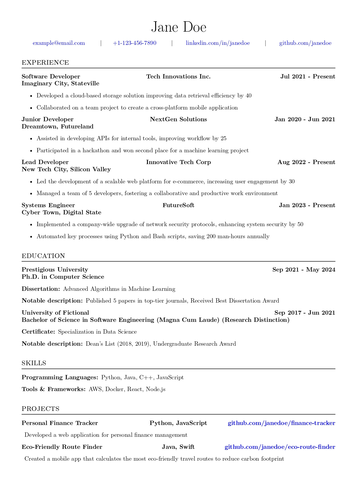

# Generate Resumes

## Introduction

Generate Resumes is a powerful tool designed to create elegant $\LaTeX$ resumes from a single source file using a simple command. This tool leverages the flexibility of $\LaTeX$ to produce professionally styled resumes, making it an ideal solution for anyone looking to streamline their resume creation process.

## Features

- **Single Source**: Generate your resume from a structured file like TOML, YAML, or JSON.
- **$\LaTeX$ Styling**: Benefit from the typographical quality of $\LaTeX$ for professional-looking resumes.
- **Customization**: Easy to customize templates and styles to fit personal or industry-specific needs.
- **Docker Support**: Containerized for easy and consistent usage across different environments.
- **Automated Workflow**: Utilizes `make` commands for a simplified build and run process.

## Prerequisites

Before you start using Generate Resumes, ensure you have the following installed:
- Docker
- GNU Make

These dependencies are crucial for running the tool in a containerized environment and using the automated workflow provided by the `make` commands.

## Getting Started

1. **Clone the Repository**
   
   Clone this repository to your local machine to get started with Generate Resumes.

   ```bash
   git clone https://github.com/urmzd/generate-resumes.git
   cd generate-resumes
   ```

2. **Initialization**

   Initialize the project, which sets up necessary directories and copies example files.

   ```bash
   make init
   ```

3. **Build the Docker Image**

   Compile the source code and build the Docker image.

   ```bash
   make build
   ```

4. **Run the Application**

   Generate a resume from a specified source file in the input folder (e.g. `example.yml`).

   ```bash
   make run FILENAME=example.yml
   ```

   This will output the generated resume in the specified output directory.

## Showcase

Here are some examples of resumes generated with our tool:

### Sample Resume 1



A clean, professional layout suitable for various industries.

## Customization

To customize your resume, edit the source file (e.g., `example.yml`) with your personal information, experiences, and skills. The tool supports various file formats like TOML, YAML, and JSON.

## Advanced Usage

For more advanced users, the following options are available for interacting with the CLI tool:

1. **Direct CLI Interaction with Specific Commands**

   Execute specific commands within the Docker container using `make exec`. This allows you to pass custom arguments and commands directly to the CLI tool. For example, to execute a command `command-name` with arguments `arg1 arg2`, use:

   ```bash
   make exec CMD="command-name arg1 arg2"
   ```

   Replace `command-name`, `arg1`, and `arg2` with your actual command and arguments. This method is useful for executing specific operations without starting an interactive shell.

2. **Interactive Shell Session**

   Start an interactive shell session within the Docker container for a more hands-on approach:

   ```bash
   make shell
   ```

   This command opens a `/bin/bash` session in the Docker container, allowing you to interact directly with the tool and the file system.

Use these advanced options for more control over the tool or for tasks that require direct interaction with the CLI environment.

## Contributing

Contributions to the Generate Resumes project are welcome. Please read our contributing guidelines and submit pull requests for any enhancements, bug fixes, or documentation improvements.

## License

This project is licensed under the [MIT License](LICENSE). Feel free to use, modify, and distribute the code as per the license terms.

## Acknowledgments

Thanks to all the contributors who have helped in building and maintaining this tool. Special thanks to the LaTeX community for the underlying typesetting system.
